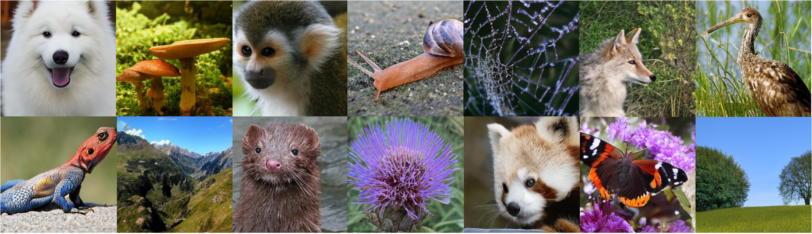

# Mirai: Autoregressive Visual Generation Needs Foresight

<div align="center">

[](https://arxiv.org/abs/25xx.xxxxx)
[](https://yourusername.github.io/Mirai-Project/)
[](LICENSE)

</div>

<p align="center">
  
</p>

This is the official PyTorch implementation of the paper **"Mirai: Autoregressive Visual Generation Needs Foresight"**.

> **Abstract:** *Autoregressive (AR) visual generators model images as sequences of discrete tokens... We propose Mirai, a general framework that injects future information into AR training...*

## 📅 News
* **[2025-XX-XX]** Code and models are released!
* **[2025-XX-XX]** Paper is available on arXiv.


## 🛠️ Installation

```bash
conda create -n mirai python=3.9
conda activate mirai
pip install -r requirements.txt
```

## 🧠 Dataset and preprocessing

We mainly on ImageNet 256x256:

```bash
torchrun --nproc_per_node=8 train.py \
    --config configs/mirai_b_imagenet.yaml \
    --data_path /path/to/imagenet
```

## 🚀 Training

To train Mirai-B on ImageNet 256x256:

```bash
torchrun --nproc_per_node=8 train.py \
    --config configs/mirai_b_imagenet.yaml \
    --data_path /path/to/imagenet
```
## ⚡ Inference / Sampling

Download our pretrained models from HuggingFace and run:

```bash
python sample.py --ckpt checkpoints/mirai_b.pt --prompt "a photo of a husky"
```

## 📊 Evaluation & Metrics

Download our pretrained models from HuggingFace and run:

```bash
python sample.py --ckpt checkpoints/mirai_b.pt --prompt "a photo of a husky"
```

## 🎓 Citation
If you find our work helpful, please cite:

```bash
@article{mirai2025,
  title={Mirai: Autoregressive Visual Generation Needs Foresight},
  author={Anonymous Authors},
  journal={CVPR Submission},
  year={2026}
}
```
## 🎓 Citation
🙏 Acknowledgements
This codebase is built upon [LlamaGen](https://github.com/FoundationVision/LlamaGen). We thank the authors for their open-source contribution.